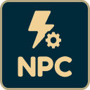

<div align="center">
</img>
<br/><br/>

<h3> Neal Password Cracker </h3>
A chrome extension that helps you to crack passwords in the neal.fun/password-game website.
</div>


## Features
- Auto Complete
- Suggestions
- Auto Bug Feeder

## Installation
1. Download the release zip and unzip it.
2. Head to chrome://extension in your browser
3. Turn on the developer mode
4. Click load unpacked extension then select the build folder.
5. Tadaaa !!!

## Run Locally

```bash
  git clone https://github.com/The-Robin-Hood/neal.password.cracker
  cd neal.password.cracker
  pnpm install
  pnpm dev
```

## Contributing

Contributions are welcome! If you encounter any issues or have suggestions for improvements, please report them on the project's GitHub page.

## License

The Project is released under the [MIT License](https://opensource.org/licenses/MIT). Please refer to the LICENSE file for more details.